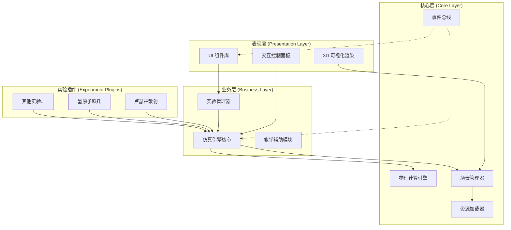

# 高中物理仿真实验系统 - 项目规范文档

> 一个可扩展的、模块化的高中物理虚拟实验平台

## 项目愿景

本项目致力于构建一个**覆盖整个高中物理课程**的交互式实验仿真平台，通过3D可视化和动画效果，让学生在安全、便捷的虚拟环境中直观体验物理现象，加深对物理概念的理解。

### 当前阶段聚焦
- **原子物理 - 原子结构单元**
  - 卢瑟福α粒子散射实验
  - 氢原子能级跃迁演示
  - 玻尔原子模型可视化

### 未来拓展规划

| 领域 | 典型实验 | 优先级 |
|------|----------|--------|
| **力学** | 胡克定律、动量守恒、机械能守恒、平抛运动 | 高 |
| **电磁学** | 电阻测量、电磁感应、楞次定律、安培力 | 高 |
| **光学** | 双缝干涉、折射率测定、光的衍射 | 中 |
| **原子物理** | 光电效应、氢原子光谱、放射性现象 | 当前 |
| **热学** | 理想气体状态方程、布朗运动 | 低 |

---

## 核心架构设计

### 设计原则

> [!IMPORTANT]
> **可扩展性优先**: 架构设计必须确保新增一个实验仿真模块时，无需重写通用功能代码。

1. **模块化 (Modularity)**: 将系统拆分为独立的、可替换的模块
2. **组件化 (Component-Based)**: 采用ECS模式管理仿真实体
3. **配置驱动 (Configuration-Driven)**: 通过JSON配置定义实验，减少硬编码
4. **插件式扩展 (Plugin Architecture)**: 新实验以插件形式接入，遵循统一接口

### 分层架构图



---

## 技术栈选型

### 推荐技术栈

| 层级 | 技术选择 | 理由 |
|------|----------|------|
| **构建工具** | Vite | 极速热更新，原生ESM支持，轻量级 |
| **前端框架** | React 18 | 组件化开发，丰富生态，TypeScript支持 |
| **3D渲染** | Three.js + React Three Fiber | 声明式3D开发，与React无缝集成 |
| **物理引擎** | Cannon.js (cannon-es) | 轻量、高性能，适合教育场景 |
| **动画库** | GSAP + @react-spring/three | 流畅的时间轴控制和物理动画 |
| **状态管理** | Zustand | 轻量、简洁，适合中小型项目 |
| **UI组件** | Radix UI + Tailwind CSS | 无头组件 + 原子化CSS，高度可定制 |
| **类型系统** | TypeScript | 类型安全，提升代码可维护性 |

### 备选方案

| 场景 | 备选技术 | 适用情况 |
|------|----------|----------|
| 复杂物理场景 | Ammo.js (Bullet Physics) | 需要软体、布料等高级物理 |
| 纯静态部署 | Vanilla JS + Three.js | 极简需求，无需npm生态 |
| 企业级需求 | Next.js | 需要SSR、SEO优化 |

---

## 项目结构

```
physics-lab/
├── src/
│   ├── core/                      # 核心引擎层
│   │   ├── engine/
│   │   │   ├── SimulationEngine.ts    # 仿真引擎核心
│   │   │   ├── PhysicsWorld.ts        # 物理世界封装
│   │   │   └── RenderLoop.ts          # 渲染循环管理
│   │   ├── scene/
│   │   │   ├── SceneManager.ts        # 场景生命周期管理
│   │   │   └── CameraController.ts    # 相机控制器
│   │   ├── assets/
│   │   │   ├── AssetLoader.ts         # 统一资源加载
│   │   │   └── ModelFactory.ts        # 3D模型工厂
│   │   ├── events/
│   │   │   └── EventBus.ts            # 全局事件总线
│   │   └── index.ts
│   │
│   ├── experiments/               # 实验插件目录
│   │   ├── base/
│   │   │   ├── ExperimentBase.ts      # 实验基类
│   │   │   ├── IExperiment.ts         # 实验接口定义
│   │   │   └── ExperimentRegistry.ts  # 实验注册中心
│   │   ├── atomic/                    # 原子物理实验
│   │   │   ├── rutherford-scattering/
│   │   │   │   ├── config.json        # 实验配置
│   │   │   │   ├── RutherfordExperiment.ts
│   │   │   │   ├── AlphaParticle.ts   # α粒子组件
│   │   │   │   ├── GoldFoil.ts        # 金箔模型
│   │   │   │   └── ScatteringPhysics.ts # 散射物理计算
│   │   │   └── hydrogen-transitions/
│   │   │       ├── config.json
│   │   │       ├── HydrogenExperiment.ts
│   │   │       ├── ElectronOrbit.ts
│   │   │       └── PhotonEmission.ts
│   │   ├── mechanics/                 # 力学实验 (待开发)
│   │   ├── electromagnetism/          # 电磁学实验 (待开发)
│   │   └── optics/                    # 光学实验 (待开发)
│   │
│   ├── components/                # React UI 组件
│   │   ├── common/
│   │   │   ├── Button/
│   │   │   ├── Slider/
│   │   │   ├── Modal/
│   │   │   └── Tooltip/
│   │   ├── simulation/
│   │   │   ├── Canvas3D.tsx           # 3D画布容器
│   │   │   ├── ControlPanel.tsx       # 控制面板
│   │   │   ├── ParameterSlider.tsx    # 参数滑块
│   │   │   ├── PlaybackControls.tsx   # 播放控制
│   │   │   └── DataDisplay.tsx        # 数据显示面板
│   │   ├── education/
│   │   │   ├── InstructionCard.tsx    # 实验说明卡片
│   │   │   ├── FormulaDisplay.tsx     # 公式展示 (KaTeX)
│   │   │   └── QuizModule.tsx         # 知识问答模块
│   │   └── layout/
│   │       ├── AppLayout.tsx
│   │       ├── Sidebar.tsx
│   │       └── Header.tsx
│   │
│   ├── hooks/                     # 自定义 Hooks
│   │   ├── useSimulation.ts           # 仿真状态管理
│   │   ├── useExperiment.ts           # 实验加载hook
│   │   ├── usePhysics.ts              # 物理引擎hook
│   │   └── useAnimation.ts            # 动画控制hook
│   │
│   ├── stores/                    # 状态管理
│   │   ├── simulationStore.ts         # 仿真状态
│   │   ├── experimentStore.ts         # 实验状态
│   │   └── uiStore.ts                 # UI状态
│   │
│   ├── utils/                     # 工具函数
│   │   ├── math/
│   │   │   ├── vectors.ts             # 向量运算
│   │   │   ├── physics-formulas.ts    # 物理公式
│   │   │   └── constants.ts           # 物理常数
│   │   ├── three/
│   │   │   ├── materials.ts           # 材质工厂
│   │   │   └── geometries.ts          # 几何体工厂
│   │   └── helpers.ts
│   │
│   ├── pages/                     # 页面组件
│   │   ├── Home.tsx                   # 首页/实验列表
│   │   ├── ExperimentView.tsx         # 实验页面
│   │   └── About.tsx
│   │
│   ├── styles/                    # 样式文件
│   │   ├── globals.css
│   │   ├── variables.css
│   │   └── components/
│   │
│   ├── App.tsx
│   ├── main.tsx
│   └── vite-env.d.ts
│
├── public/
│   ├── models/                    # 3D模型文件 (.glb/.gltf)
│   ├── textures/                  # 纹理贴图
│   ├── sounds/                    # 音效文件
│   └── favicon.svg
│
├── tests/                         # 测试文件
│   ├── unit/
│   ├── integration/
│   └── e2e/
│
├── docs/                          # 文档
│   ├── experiments/               # 实验开发指南
│   └── api/                       # API 文档
│
├── package.json
├── tsconfig.json
├── vite.config.ts
├── tailwind.config.js
├── .eslintrc.js
└── README.md
```

---

## 核心接口设计

### 实验插件接口

每个实验必须实现 `IExperiment` 接口，确保统一的生命周期管理：

```typescript
// src/experiments/base/IExperiment.ts

interface ExperimentMetadata {
  id: string;                      // 唯一标识符
  name: string;                    // 实验名称
  category: ExperimentCategory;    // 所属类别
  description: string;             // 实验描述
  difficulty: 'basic' | 'intermediate' | 'advanced';
  duration: number;                // 预计时长(分钟)
  keywords: string[];              // 搜索关键词
  thumbnail: string;               // 缩略图路径
}

interface ExperimentConfig {
  physics: {
    gravity?: [number, number, number];
    timestep?: number;
    maxSubSteps?: number;
  };
  camera: {
    position: [number, number, number];
    target: [number, number, number];
    fov?: number;
  };
  parameters: ParameterDefinition[];  // 可调参数定义
}

interface IExperiment {
  // 元数据
  readonly metadata: ExperimentMetadata;
  readonly config: ExperimentConfig;

  // 生命周期方法
  init(scene: THREE.Scene, physics: PhysicsWorld): Promise<void>;
  start(): void;
  pause(): void;
  resume(): void;
  reset(): void;
  dispose(): void;

  // 每帧更新
  update(deltaTime: number): void;

  // 参数控制
  setParameter(key: string, value: number | string | boolean): void;
  getParameter(key: string): ParameterValue;

  // 数据输出
  getDisplayData(): Record<string, DisplayValue>;

  // 事件处理
  onInteraction?(event: InteractionEvent): void;
}
```

### 实验注册机制

```typescript
// src/experiments/base/ExperimentRegistry.ts

class ExperimentRegistry {
  private static experiments = new Map<string, ExperimentConstructor>();

  // 注册实验
  static register(id: string, experimentClass: ExperimentConstructor): void {
    this.experiments.set(id, experimentClass);
  }

  // 按类别获取实验列表
  static getByCategory(category: ExperimentCategory): ExperimentMetadata[] {
    // ...
  }

  // 实例化实验
  static create(id: string): IExperiment {
    const ExperimentClass = this.experiments.get(id);
    if (!ExperimentClass) {
      throw new Error(`Experiment "${id}" not registered`);
    }
    return new ExperimentClass();
  }
}

// 使用装饰器简化注册
@registerExperiment('rutherford-scattering')
class RutherfordExperiment extends ExperimentBase {
  // ...
}
```

---

## 开发流程

### 环境要求

- **Node.js**: 18.0+
- **包管理器**: pnpm (推荐) 或 npm
- **浏览器**: Chrome 100+, Firefox 100+, Safari 15+
- **WebGL**: 支持 WebGL 2.0

### 快速开始

```bash
# 克隆项目
git clone <repo-url>
cd physics-lab

# 安装依赖
pnpm install

# 启动开发服务器
pnpm dev

# 构建生产版本
pnpm build

# 运行测试
pnpm test
```

### 开发阶段规划

#### Phase 1: 基础架构 (Week 1-2)
- [ ] 项目初始化 (Vite + React + TypeScript)
- [ ] 核心引擎搭建 (SimulationEngine, SceneManager)
- [ ] 物理世界封装 (Cannon.js 集成)
- [ ] 基础UI组件库
- [ ] 路由与布局

#### Phase 2: 原子物理实验 (Week 3-4)
- [ ] 实验基类与注册机制
- [ ] 卢瑟福散射实验实现
- [ ] 氢原子跃迁实验实现
- [ ] 控制面板与参数调节
- [ ] 数据展示与公式渲染

#### Phase 3: 完善与优化 (Week 5-6)
- [ ] 动画效果优化
- [ ] 教学辅助模块
- [ ] 响应式设计
- [ ] 性能优化
- [ ] 文档与使用指南

#### Phase 4: 扩展实验 (持续)
- [ ] 力学实验模块
- [ ] 电磁学实验模块
- [ ] ...

---

## 编码规范

### UI 国际化规范

> [!IMPORTANT]
> **所有面向用户的界面文本必须使用英文**

1. **实验标题和描述**
   - 实验类 `metadata.name` 必须使用英文
   - 描述使用专业准确的科技英文术语

2. **按钮和控件**
   - 统一术语：`Back`、`Start`、`Pause`、`Resume`、`Reset`
   - 使用祈使句，简洁明确

3. **物理术语翻译标准**
   - 受激吸收 → `Stimulated Absorption`
   - 自发辐射 → `Spontaneous Emission`
   - 受激辐射 → `Stimulated Emission`
   - 能级跃迁 → `Energy Level Transition`
   - 散射 → `Scattering`

4. **按钮样式统一**
   - 使用渐变背景：`bg-gradient-to-r from-{color}-600 to-{color}-500`
   - 添加阴影：`shadow-lg shadow-{color}-900/30`
   - 统一间距：`gap-2.5 px-5 py-2.5`
   - 过渡动画：`transition-all duration-200`

### TypeScript 规范

```typescript
// ✅ 使用接口定义组件Props
interface ButtonProps {
  variant: 'primary' | 'secondary';
  onClick: () => void;
  children: React.ReactNode;
}

// ✅ 使用类型守卫
function isParticle(obj: unknown): obj is Particle {
  return obj !== null && typeof obj === 'object' && 'mass' in obj;
}

// ✅ 使用常量枚举
const enum ExperimentCategory {
  Mechanics = 'mechanics',
  Electromagnetism = 'electromagnetism',
  Optics = 'optics',
  AtomicPhysics = 'atomic',
  Thermodynamics = 'thermodynamics',
}
```

### 文件命名规范

| 类型 | 命名格式 | 示例 |
|------|----------|------|
| React 组件 | PascalCase | `ControlPanel.tsx` |
| 类文件 | PascalCase | `SimulationEngine.ts` |
| Hook 文件 | camelCase (use前缀) | `useSimulation.ts` |
| 工具函数 | kebab-case | `physics-formulas.ts` |
| 配置文件 | kebab-case | `vite.config.ts` |
| 测试文件 | 同源文件 + .test/.spec | `SimulationEngine.test.ts` |

### 物理单位约定

> [!WARNING]
> 所有物理计算统一使用国际单位制 (SI)，显示时可转换为教学常用单位。

| 物理量 | 内部单位 | 显示单位示例 |
|--------|----------|--------------|
| 长度 | m (米) | nm, μm, mm |
| 时间 | s (秒) | ms, μs |
| 质量 | kg (千克) | amu, MeV/c² |
| 能量 | J (焦耳) | eV, keV, MeV |
| 电荷 | C (库仑) | e (电子电荷) |

---

## 测试策略

### 单元测试 (Vitest)

```typescript
// tests/unit/physics-formulas.test.ts
describe('coulombForce', () => {
  it('should calculate correct repulsion force', () => {
    const force = coulombForce(1e-9, 1e-9, 0.01);
    expect(force).toBeCloseTo(8.99e-5, 2);
  });
});
```

### 集成测试

```typescript
// tests/integration/experiment-lifecycle.test.ts
describe('Experiment Lifecycle', () => {
  it('should properly init, run, and dispose', async () => {
    const experiment = ExperimentRegistry.create('rutherford-scattering');
    await experiment.init(mockScene, mockPhysics);
    experiment.start();
    // ...
    experiment.dispose();
    expect(mockScene.children).toHaveLength(0);
  });
});
```

### E2E测试 (Playwright)

```typescript
// tests/e2e/rutherford.spec.ts
test('用户可以调节α粒子入射速度', async ({ page }) => {
  await page.goto('/experiment/rutherford-scattering');
  const slider = page.getByRole('slider', { name: '入射速度' });
  await slider.fill('1500');
  await expect(page.getByTestId('velocity-display')).toHaveText('1500 km/s');
});
```

### 性能监控

- 使用 `stats.js` 监控帧率
- 使用 `@react-three/drei` 的 `Perf` 组件
- 目标: 在主流设备上保持 60 FPS

---

## 资源与参考

### 技术文档

- [Three.js 官方文档](https://threejs.org/docs/)
- [React Three Fiber](https://docs.pmnd.rs/react-three-fiber/)
- [Cannon.js 文档](https://pmndrs.github.io/cannon-es/)
- [GSAP 动画库](https://greensock.com/docs/)
- [Zustand 状态管理](https://docs.pmnd.rs/zustand/)

### 设计参考

- [PhET Interactive Simulations](https://phet.colorado.edu/) - 教育物理仿真的标杆
- [myPhysicsLab](https://www.myphysicslab.com/) - 优秀的物理模拟示例
- [Physion](https://physion.net/) - 交互式物理引擎

### 物理参考

- 人教版高中物理教材
- Resnick & Halliday《物理学基础》
- [HyperPhysics](http://hyperphysics.phy-astr.gsu.edu/)

---

## 变更记录

### 2026-01-18 - 国际化与UI规范

- ✨ **新增 UI 国际化规范**：所有用户界面文本必须使用英文
- ✨ **统一按钮样式标准**：渐变背景、阴影效果、平滑动画
- 📝 **物理术语翻译标准**：Stimulated Absorption、Spontaneous Emission 等
- 🎨 **视觉风格统一**：科技未来主义设计语言

### 2025-12-04 21:25 - 架构重构

**重大更新**: 基于行业调研，全面重构架构设计

- ✨ 采用**插件式架构**，实验模块化接入
- ✨ 引入**TypeScript**增强类型安全
- ✨ 使用**React + React Three Fiber**构建UI层
- ✨ 制定**IExperiment接口**规范实验开发
- ✨ 规划完整的**高中物理实验分类体系**
- ✨ 添加详细的**技术选型对比**和**编码规范**
- 🔧 更新项目结构，支持多领域实验扩展

### 2025-12-04 21:12 - 初始版本

- 创建基础项目框架文档
- 定义初步技术栈建议

---

## AI 开发助手使用指引

### 新增实验的标准流程

1. **创建实验目录**: `src/experiments/{category}/{experiment-name}/`
2. **定义配置文件**: 编写 `config.json` 声明实验参数
3. **实现实验类**: 继承 `ExperimentBase`，实现 `IExperiment` 接口
4. **注册实验**: 使用 `@registerExperiment` 装饰器
5. **编写测试**: 添加单元测试和集成测试
6. **更新文档**: 在 `docs/experiments/` 添加实验说明

### 开发时的关键提示

- 所有 3D 对象必须通过 `SceneManager` 管理，确保正确的资源释放
- 物理计算与渲染循环分离，使用固定时间步长
- 参数变化通过 `EventBus` 广播，实现松耦合
- 优先使用 `InstancedMesh` 渲染大量相同对象

## 开发方法论改进

### 问题解决原则

1. **先全局后局部**：先了解整体结构，再修改细节
   - 在修复具体问题前，先全面了解布局结构和CSS层级关系
   - 检查全局样式、组件结构、技术栈相互作用

2. **系统性思考**：修复一个问题时要考虑对其他部分的影响
   - 每次修改都要评估对整体视觉效果的影响
   - 一次性解决相关的连带问题，避免多次反复

3. **使用高优先级方案**：当CSS冲突时，优先使用内联样式
   - Tailwind类可能被全局样式重置覆盖时，使用内联样式确保生效
   - 在关键布局调整时，优先采用直接有效的方案

4. **简化优于复杂**：减少不必要的动画层和嵌套结构
   - 避免过度设计，保持代码简洁可维护
   - 移除不必要的装饰性动画，专注核心功能

### 实践经验总结

**成功案例 - 首页卡片设计优化:**
- **问题**: 标题被圆角裁剪、悬停效果明显矩形、边距不合理
- **根本原因**: `* { padding: 0; }` 全局重置 + `absolute inset-0` + `overflow-hidden` 组合问题
- **解决方案**: 精确的内联样式边距 + 简化背景效果 + 整体视觉平衡
- **关键洞察**: CSS优先级冲突需要更高优先级方案，系统性考虑所有相关元素

---

*本文档随项目发展持续更新，最后修改时间: 2026-01-18*